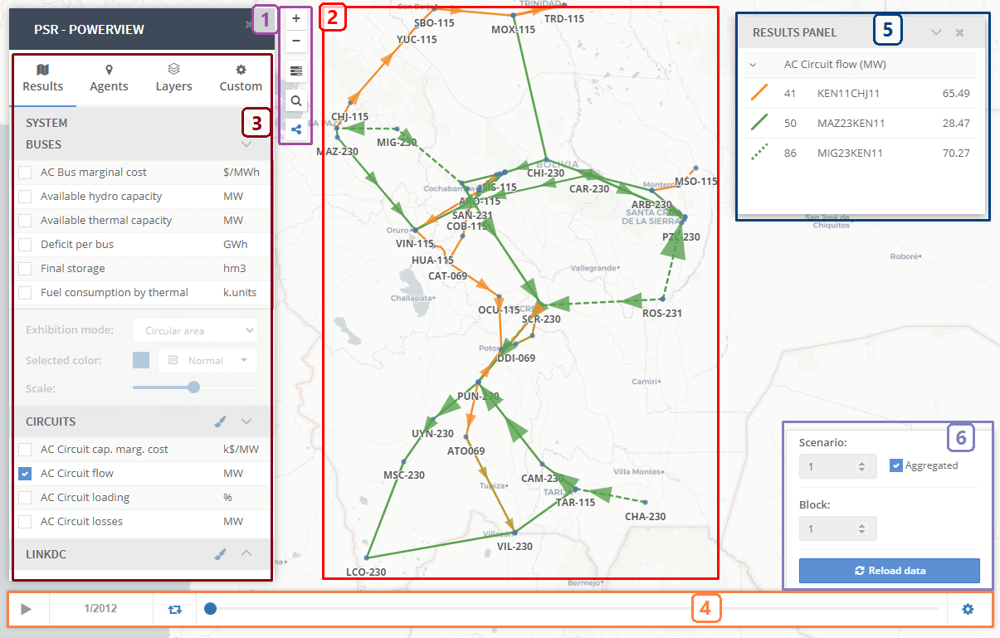

# Welcome to Power View
{: .no_toc }

Power View is a tool for the graphical visualization of transmission-related study results of PSR models. This tool allows the visualization on a map, in a georeferenced and integrated environment, of animated circuit flows, circuit loading, and bus-related information such as bus generation and load. It is also possible to show an animated chronological evolution of the variables along the study period.

---

## Overview
{: .no_toc }

The figure below shows the main sections of the graphical interface:

    

## Table of contents
{: .no_toc .text-delta }

1. TOC
{:toc}
---

## Quick access buttons
The quick-access buttons provide the following extra functionalities.

### Zoom control
* The Zoom control is a pair of +/- buttons for zooming in and out.

### Toggle menu
* Allows you to open and close the side menu after clicking the Toggle menu button. The goal is to hide the side menu, allowing you to display all map content.

### Search menu
* Searches for an element (buses, circuits, and DC links) and place it in the center of the workspace.

### Diagram viewer
* Toggle circuit exhibition mode between *Schematic diagram* and *Georeferenced*
    * Schematic diagram: represents the circuits as continuous straight lines connecting their terminal buses.
    * Georeferenced: represents the circuits as continuous segments connecting each node of the informed coordinates along the circuit path. The circuits without accurate coordinates available are represented schematically as a straight dashed line.

## Workspace
The workspace is the main component of the graphical interface. In this area, Power View graphically displays buses and circuits of the network and shows selected bus- and transmission-related results of PSR models in its georeferenced and integrated environment.

Power View relies on OpenLayers' which enables map navigation and zooming functions to highlight the geographical areas of interest.

## Side menu
The menu provides the following extra functionalities.

### Result selection

The selection panel shows the available variables for each group of agents (system, bus, and circuit).

* Variables list: shows a list with all the variables associated with the selected group.
* Selected for showing: enables the graphical representation of the selected variable in the workspace.
* Name: displays the name of the selected variable.
* Exhibition mode: graphical options to display the selected variable for each agent in the workspace.
* Selected color: defines the color of the selected variable in the workspace.
* No fill: defines that the graphical representation in the workspace must be transparent.
* Scale: defines the scale of the graphical representation of the selected variable in the workspace.
	
### Agents list
Shows a list of all the agents associated with the selected group.

### Layers
A base map provides a background of the geographic context for the workspace. It includes a base map gallery with various choices, including topography, imagery, and streets.

### Customization options
Allows you to modify general Power View settings.
	
## Simulation panel
This panel shows the controls related to the chronological evolution of simulation variables. The user can select a particular stage of interest or "play" an animated chronological evolution of the simulation variables along the study period. It is possible to adjust the animation speed as needed.

The following controls are available:
* Play/Pause: starts or pauses the execution from the current stage in the forward direction.
* Stage: displays the current stage on the workspace.
* Loop: repeats simulation after the last stage.
* Time slider: drag the time slider to visualize the timeline animation.
* Configuration dataset: opens dataset configuration.

## Result panel
This panel displays the numerical values of the selected variables for the agents chosen with the mouse.

## Dataset configuration 
* Scenario: selection of the desired scenario for visualization.
* Block: selection of the desired block for visualization.
* Show aggregated: displays the average values per scenario and the weighted average value per block.
